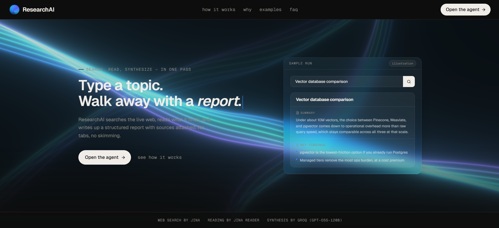

# ResearchAI

**Live:** [researchai-rm.vercel.app](https://researchai-rm.vercel.app)

Type a topic, get a short research report with sources. The server searches the
web (Jina), reads the top results (Jina Reader), and has an LLM on Groq write a
summary and key findings. Progress streams to the client over SSE, including
per-source success/failure, so the UI only shows what actually happened.

It's a fixed pipeline (search → fetch → synthesize), not an agent.

